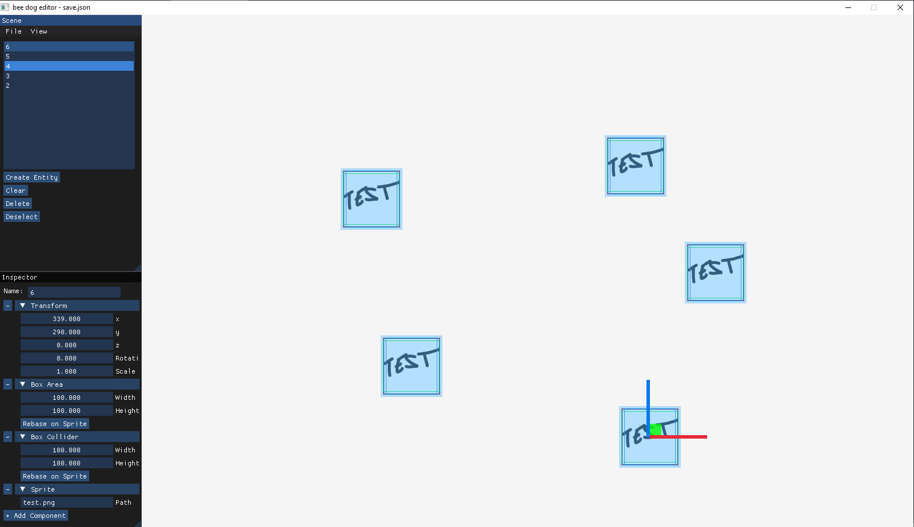

# bee dog engine #

Game engine designed around raylib and entt

raylib: https://github.com/raysan5/raylib \
entt:  https://github.com/skypjack/entt \
rlImGui: https://github.com/raylib-extras/rlImGui \
Using https://github.com/SasLuca/raylib-cmake-template as a base

## editor ##

bee dog engine comes with a very basic editor, designed for level creation\
currenlty supports:
- manipulating object positions
- adding / removing components (as long as they can be serialized)

